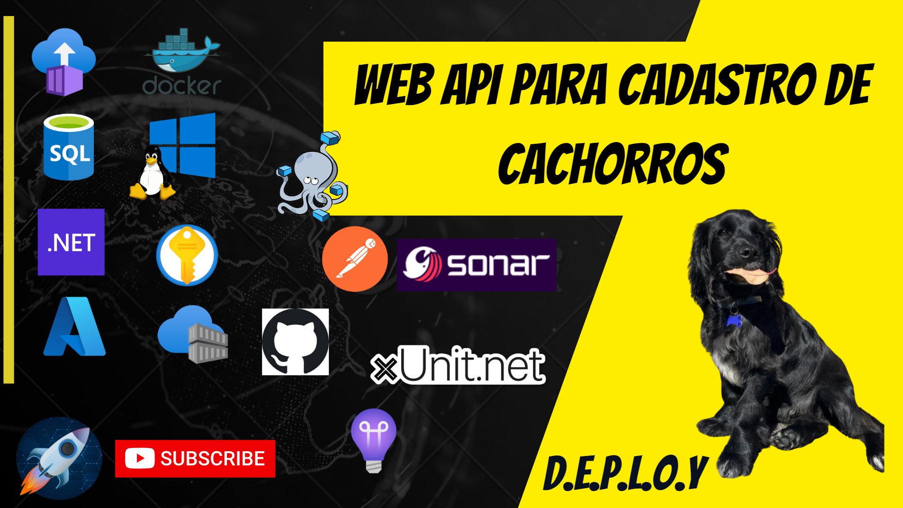

# DEPLOY.Cachorro.Api



[](https://sonarcloud.io/summary/new_code?id=felipementel_DEPLOY.Cachorro.Api)

# Configuração local do Git

```
git config --local --list
```

```
git config --local user.name "Felipe Augusto"
```

```
git config --local user.email felipementel@hotmail.com
```

Projeto educacional, criado e mantido através do canal DEPLOY no YouTube.

> Para criar a imagem, a partir do diretório root da aplicação (pasta que contem o arquivo sln)

# pre-requisitos para executar o projeto

1. Docker
2. Um conta no Azure para criar recursos

```
mnt ❯ c ❯ proj ❯ DEPLOY ❯ DEPLOY.Cachorro $ docker build -f ./DEPLOY.Cachorro.Api/Dockerfile  -t crcanaldeploydev.azurecr.io/cachorro.api:latest .
```

dotnet run --project ./src/DEPLOY.Cachorro.Api/DEPLOY.Cachorro.Api.csproj ASPNETCORE_ENVIRONMENT=aaa ConnectionStrings:ApplicationInsights="bbb" ConnectionStrings:DefaultConnection="ccc" ConnectionStrings:AppConfiguration="ddd"
ApplicationInsights:ApiKey="eee" KeyVault:VaultUri="fff"

> Para executar o projeto local, utilizando docker

```
docker container run --rm -p 8088:80 \
-e ASPNETCORE_ENVIRONMENT=aaa \
-e ConnectionStrings__ApplicationInsights="bbb" \
-e ConnectionStrings__DefaultConnection="ccc" \
-e ConnectionStrings__AppConfiguration="ddd" \
-e ApplicationInsights__ApiKey="eee" \
-e KeyVault__VaultUri="fff" \
felipementel/cachorro.api:latest
```

aaa = Development|Production
bbb = ConnectionString do Application Insights
ccc = Connection String (Azure SQL Database ou https://hub.docker.com/_/microsoft-azure-sql-edge)
ddd = Connection string do App Configuration
eee = ApiKey gerada dentro do Application Insights
fff = URI do Azure KeyVault

Comando para subir o banco de dados local:

```
docker run --cap-add SYS_PTRACE -e 'ACCEPT_EULA=1' -e 'MSSQL_SA_PASSWORD=Abcd1234%' -e 'MSSQL_PID=Developer' -p 1433:1433 --name azuresqledge -d mcr.microsoft.com/azure-sql-edge:2.0.0
```

Caso queira testar com outra tag, utilize os comandos abaixo para obter a lista de tags

```
https://mcr.microsoft.com/v2/azure-sql-edge/tags/list
```

# Testes de unidade

Tecnologia: XUnit

0. Pre requisito
   Será necessário instalar os dois pacotes abaixo para ter sucesso ao executar os comandos descritos nesse arquivo.

```
dotnet tool install --global dotnet-reportgenerator-globaltool
```

```
dotnet tool install --global dotnet-coverage
```

1. Como Executar:
   1.1 A partir da pasta src execute o comando:

```
dotnet test
```

2. Geração de relatório de testes

   1.1 A partir da pasta src execute o comando:

```
dotnet test --collect:"XPlat Code Coverage" --logger "console;verbosity=detailed" --results-directory .\DEPLOY.Cachorro.Api.Tests\TestResults\XPlatCodeCoverage\
```

e depois execute:

```
reportgenerator -reports:.\DEPLOY.Cachorro.Api.Tests\TestResults\XPlatCodeCoverage\**\coverage.cobertura.xml  -targetdir:./DEPLOY.Cachorro.Api.Tests/TestResults/XPlatCodeCoverage/CoverageReport -reporttypes:"Html;SonarQube;JsonSummary;Badges" -verbosity:Verbose -title:Cachorro.API -tag:canal-deploy
```

ou

```
$var = (Get-Date).ToString("yyyyMMdd-HHmmss"); dotnet-coverage collect "dotnet test" -f xml -o ".\DEPLOY.Cachorro.Api.Tests\TestResults\DotnetCoverageCollect\$var\coverage.cobertura.xml"
```

```
reportgenerator -reports:.\DEPLOY.Cachorro.Api.Tests\TestResults\DotnetCoverageCollect\**\coverage.cobertura.xml  -targetdir:./DEPLOY.Cachorro.Api.Tests/TestResults/DotnetCoverageCollect/CoverageReport -reporttypes:"Html;SonarQube;JsonSummary;Badges" -verbosity:Verbose -title:Cachorro.API -tag:canal-deploy
```

1.2 A partir da pasta src execute o comando:

---

# EntityFramework Commands

```

dotnet tool install --global dotnet-ef

```

```

dotnet ef migrations add InitDatabaseAPI -s DEPLOY.Cachorro.Api -p DEPLOY.Cachorro.Repository -c DEPLOY.Cachorro.Repository.CachorroDbContext --output-dir Migrations/API -v

```

```

dotnet ef database update InitDatabaseAPI --startup-project DEPLOY.Cachorro.Api --project DEPLOY.Cachorro.Repository --context DEPLOY.Cachorro.Repository.CachorroDbContext --verbose

```

Connection String

```

Data Source=127.0.0.1,1433;Initial Catalog=Cachorro;User Id=sa;Password=Abcd1234%;Integrated Security=False;MultipleActiveResultSets=True;TrustServerCertificate=true;

```

<br/>
<br/>
<br/>
<br/>
<br/>

# Link de documentações citadas durante a criaçao do projeto

```
https://learn.microsoft.com/en-us/dotnet/core/tools/dotnet
```

```

https://learn.microsoft.com/en-us/aspnet/core/fundamentals/logging/?view=aspnetcore-7.0

```

```

https://learn.microsoft.com/en-us/aspnet/core/security/app-secrets?view=aspnetcore-7.0&tabs=windows

```

ILogger

```

https://learn.microsoft.com/en-us/aspnet/core/fundamentals/logging/?view=aspnetcore-7.0

```

```

https://learn.microsoft.com/en-us/dotnet/core/tools/dotnet-test

```

```

https://learn.microsoft.com/en-us/azure/azure-monitor/app/ilogger?tabs=dotnet6

```

Application Insights

```

https://learn.microsoft.com/pt-br/azure/azure-monitor/app/asp-net-core?tabs=netcorenew%2Cnetcore6

```

Live Stream / Live Metrics

```

https://learn.microsoft.com/en-us/azure/azure-monitor/app/live-stream?tabs=dotnet6

```

Configurations

```

https://learn.microsoft.com/en-us/aspnet/core/fundamentals/configuration/?view=aspnetcore-7.0

```

Docker Commands

```

docker container rm -f $(docker ps -a -q)

```

```

docker volume rm $(docker volume ls -q)\

```

```

docker image rm -f $(docker image ls -a -q)

```

```

docker system prune

```

```

docker image ls

```

```

docker tag 430f5d9f4229 crcanaldeploydev.azurecr.io/cachorro.api:latest

```

```

docker push crcanaldeploydev.azurecr.io/cachorro.api:latest

```

```

docker push ghcr.io/felipementel/cachorro.api:latest

```

```

docker container run -p 8088:80 crcanaldeploydev.azurecr.io/cachorro.api:latest

```

```

docker container run --rm --name sonar-canal-deploy -p 9044:9000 sonarqube:10.3.0-community

```

Comandos Azure Key Vault

```

az keyvault secret show --name CachorroConnectionString --vault-name kv-canaldeploy-dev

```

```

@Microsoft.KeyVault(SecretUri=https://kv-canaldeploy-dev.vault.azure.net/secrets/ConnectionStrings--ApplicationInsights/)

```

```

@Microsoft.KeyVault(VaultName=kv-canaldeploy-dev;SecretName=ConnectionStrings--ApplicationInsights)

```

Comandos Azure Container Instance

```

az container logs --resource-group rg-canaldeploy-dev --name api-cachorro

```

```

az container exec -g g-canaldeploy-dev --name cachorro.api --exec-command "/bin/bash"

```

/d:sonar.cs.vscoveragexml.reportsPaths=coverage.xml

```

```

#git
#github
#github-actions
#sonar-qube
#wsl-2
#docker
#docker-compose
#docker-hub
#donet
#ef-core
#entity-framework-core
#x-unit
#postman
#azure
#azure-application-ingishts
#azure-sql-database
#azure-app-configuration
#azure-container-registry
#azure-container-instance
#azure-container-apps
#azure-key-vault
